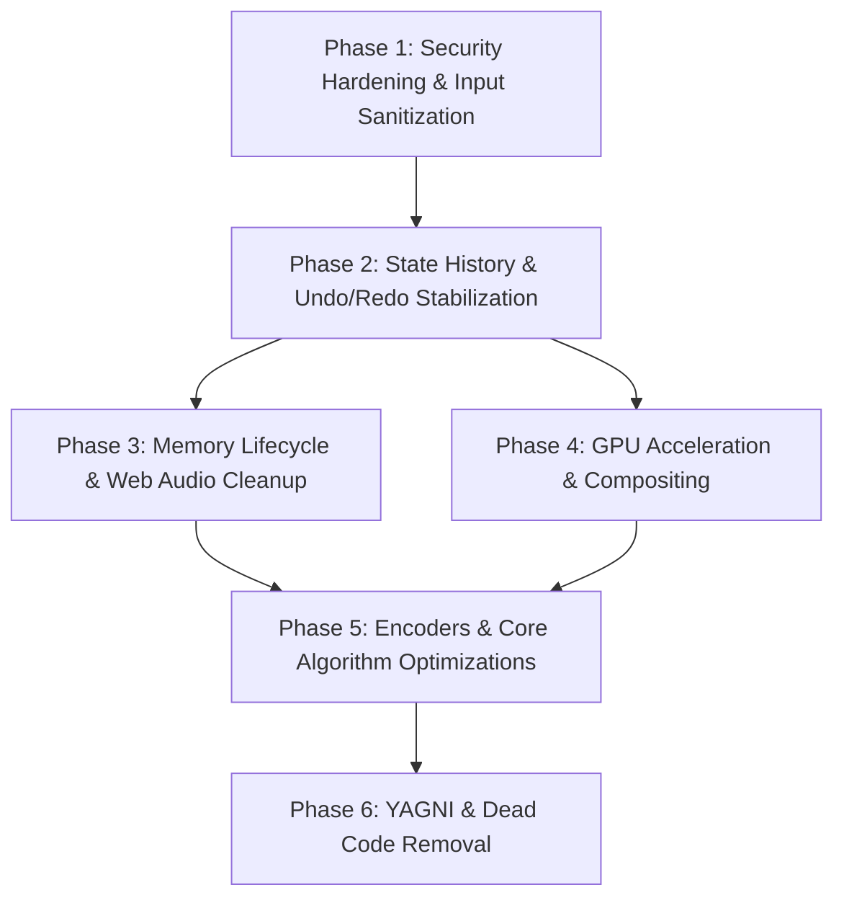

# WaveScribe • Remediation & Fix Progression Plan

**Target Document:** [`docs/audit_report.md`](file:///d:/Programing/music-transcriber/docs/audit_report.md)  
**Execution Context:** Production-grade, zero-backend, single-page Web Audio transcriber ([`index.html`](file:///d:/Programing/music-transcriber/index.html) + [`src/`](file:///d:/Programing/music-transcriber/src))  
**Objective:** Provide a phased, risk-ranked task progression plan to remediate all 21 audit findings without regressing existing features, breaking visual sub-pixel alignment, or violating core architectural invariants.

---

## Phasing Strategy & Dependency Graph



### Rationale for Phasing
1. **Phase 1 (Security First):** Closes all DOM XSS attack vectors and malformed JSON crashes before altering state mutation pipelines.
2. **Phase 2 (State & History Integrity):** Fixes fundamental state mutation patterns (`snapshotForHistory`, drag handles, and undo/redo) before memory and GPU adjustments.
3. **Phase 3 (Memory & Lifecycle):** Prevents browser tab heap bloat during extended transcribing sessions.
4. **Phase 4 (GPU & Animation):** Offloads playhead updates to GPU compositing threads for smooth 60–144 FPS playback.
5. **Phase 5 (Encoders & Algorithms):** Resolves specification defects in exported MIDI and MusicXML files and accelerates large-track exports.
6. **Phase 6 (YAGNI & Cleanup):** Eliminates dead legacy CSS and consolidates redundant persistence schemas once functional behavior is locked down.

---

## Master Remediation Task Checklist & Progress Tracker

### Phase 1: Security Hardening & Input Sanitization (P0)
- [x] **Task 1.1:** Replace `innerHTML` Sinks with Safe DOM Construction (`AUDIT-S1`)
- [x] **Task 1.2:** Validate Schema on Session Import & Storage Retrieval (`AUDIT-S2`)
- [x] **Task 1.3:** Add Content Security Policy & Offline Font Fallbacks (`AUDIT-S3`)

### Phase 2: State History & Undo/Redo Stabilization (P0)
- [x] **Task 2.1:** Fix Piano Roll Drag Mutation & Undo Inversion (`AUDIT-B1`)
- [x] **Task 2.2:** Suppress Snapshot Flooding During Annotation Block Dragging (`AUDIT-B2`)
- [x] **Task 2.3:** Prevent Boot Session Restore from Populating Undo Stack (`AUDIT-B3`)
- [x] **Task 2.4:** Support Note-to-Rest Conversion in `updateNote` (`AUDIT-B4`)
- [x] **Task 2.5:** Full "New Session" Audio, Storage, and Canvas Reset (`AUDIT-B5`)
- [x] **Task 2.6:** Fix Track Rename DOM Destruction & Provide Rename Affordance (`AUDIT-B6`)
- [x] **Task 2.7:** Piano Roll Additive Selection (Shift+Click) and Synchronous Multi-Note Dragging (`AUDIT-B7`)

### Phase 3: Memory Lifecycle & Web Audio Node Disconnection (P1)
- [x] **Task 3.1:** Audio Blob Object URL Revocation (`AUDIT-M1`)
- [x] **Task 3.2:** Deterministic Web Audio Node Disconnection via `onended` (`AUDIT-M2`)
- [x] **Task 3.3:** Dynamic Dropdown Listener Cleanup (`AUDIT-M3`)

### Phase 4: GPU Acceleration & Compositing Pipeline (P1)
- [x] **Task 4.1:** Hardware-Accelerated Playhead Positioning (`AUDIT-G1`)
- [x] **Task 4.2:** Consolidate Viewport Canvas Metrics Passes

### Phase 5: Encoders & Core Algorithm Optimizations (P2)
- [x] **Task 5.1:** Standard MIDI VLQ Length & UTF-8 Encoding (`AUDIT-E1`, `AUDIT-E2`)
- [x] **Task 5.2:** MusicXML Measure Padding & Dynamic Key Signature (`AUDIT-E3`, `AUDIT-E4`)
- [x] **Task 5.3:** Optimize Letter Notes Export Algorithmic Complexity (`AUDIT-O1`)
- [x] **Task 5.4:** Sub-Octave MIDI Support in `midiToNoteName` (`AUDIT-C1`)

### Phase 6: YAGNI & Dead Code Removal (P3)
- [x] **Task 6.1:** Purge Orphan CSS & Empty Ribbon Logic (`AUDIT-Y1`)
- [x] **Task 6.2:** Consolidate LocalStorage Persistence (`AUDIT-Y2`)

---

## Phase 1: Security Hardening & Input Sanitization (P0)

### [x] Task 1.1: Replace `innerHTML` Sinks with Safe DOM Construction (`AUDIT-S1`)
- [x] **Status:** Completed
- **Impacted Files:** [`index.html:2451-2474`](file:///d:/Programing/music-transcriber/index.html#L2451-L2474), [`index.html:3789-3794`](file:///d:/Programing/music-transcriber/index.html#L3789-L3794)
- **Problem:** `track.name`, `track.color`, `note.pitchName`, and `note.chordLabel` are interpolated directly into template literals passed to `innerHTML`.
- **Implementation Steps:**
  1. In `renderMixerStrips()`:
     - Construct track header DOM using `document.createElement()`.
     - Assign `track.name` via `element.textContent`.
     - Validate `track.color` against `/^#[0-9a-fA-F]{6}$/` before applying to `element.style.background`.
  2. In `renderAnnotationTrack()`:
     - Construct note block elements safely; populate `.annotation-block-pitch` and `.annotation-block-chord` using `textContent`.
     - Sanitize attribute titles (`block.title`).
- **Verification:**
  - `node --test test/audit_findings.test.mjs` -> Test `rejects or sanitises HTML in track names` must pass.
  - Test with payload `` in track and note names; confirm text renders literally without executing.

---

### [x] Task 1.2: Validate Schema on Session Import & Storage Retrieval (`AUDIT-S2`)
- [x] **Status:** Completed
- **Impacted Files:** [`src/state.js:1111-1138`](file:///d:/Programing/music-transcriber/src/state.js#L1111-L1138), [`src/storage.js:168-182`](file:///d:/Programing/music-transcriber/src/storage.js#L168-L182)
- **Problem:** `importSessionJSON()` blindly merges unvalidated objects into store state.
- **Implementation Steps:**
  1. Add a schema validator function `sanitizeSessionPayload(data)`:
     - Ensure `tracks` is an array of objects with valid `id`, sanitized `name`, validated `color` hex, and clamped `volume` ($[0.0, 1.0]$).
     - Ensure `notes` elements have finite numeric `startTime` ($\ge 0$), `duration` ($\ge 0.01$), `midi` ($[0, 127]$ or `null` for rests), and string `pitchName`.
     - Filter out Prototype Pollution keys (`__proto__`, `constructor`, `prototype`).
  2. Reject or sanitize malformed notes gracefully without throwing runtime errors.
- **Verification:**
  - `node --test test/audit_findings.test.mjs` -> Tests `rejects non-hex track colours` and `rejects structurally invalid notes` must pass.
  - Verify existing session test passes: `node --test test/session-schema.test.mjs`.

---

### [x] Task 1.3: Add Content Security Policy & Offline Font Fallbacks (`AUDIT-S3`)
- [x] **Status:** Completed
- **Impacted Files:** [`index.html:1-25`](file:///d:/Programing/music-transcriber/index.html#L1-L25)
- **Problem:** External Google Fonts link fails when offline, violating Invariant 1 (offline-first zero-backend).
- **Implementation Steps:**
  1. Add standard `<meta http-equiv="Content-Security-Policy">` restricting script, object, and style sources.
  2. Update `@font-face` and CSS font stacks in `<style>` to include robust local system fallbacks:
     ```css
     font-family: 'Inter', -apple-system, BlinkMacSystemFont, 'Segoe UI', Roboto, sans-serif;
     font-family: 'JetBrains Mono', ui-monospace, SFMono-Regular, Menlo, Monaco, Consolas, monospace;
     ```
- **Verification:**
  - Load application in headless browser with network disabled (`offline = true`); confirm canvas text measurement and ruler layout do not distort.

---

## Phase 2: State History & Undo/Redo Stabilization (P0)

### [x] Task 2.1: Fix Piano Roll Drag Mutation & Undo Inversion (`AUDIT-B1`)
- [x] **Status:** Completed
- **Impacted Files:** [`index.html:6282-6299`](file:///d:/Programing/music-transcriber/index.html#L6282-L6299), [`index.html:6378-6404`](file:///d:/Programing/music-transcriber/index.html#L6378-L6404), [`index.html:6450-6456`](file:///d:/Programing/music-transcriber/index.html#L6450-L6456)
- **Problem:** Piano roll drag mutates the note object in-memory during `mousemove`. On `mouseup`, `updateNote()` snapshots the *post-drag* state, making the drag impossible to undo.
- **Implementation Steps:**
  1. When initializing drag state on `mousedown`:
     - Store a clone of the initial note state: `origNote: { ...hit.note }`.
  2. During `mousemove`:
     - Update drag preview rendering coordinates on `pianoRollDragState` or temporary preview properties, rather than altering the canonical state note directly.
  3. On `mouseup`:
     - If the note moved, revert temporary state to `origNote` and call `store.updateNote(id, { startTime, midi, pitchName })` so that `snapshotForHistory()` captures the true *pre-drag* state before applying changes.
- **Verification:**
  - `node --test test/audit_findings.test.mjs` -> Test `piano-roll drag pattern is undoable` must pass.
  - Manual verification: Draw note at $1.0\text{s}$, drag to $3.0\text{s}$, press `Ctrl+Z`; note must return to $1.0\text{s}$.

---

### [x] Task 2.2: Suppress Snapshot Flooding During Annotation Block Dragging (`AUDIT-B2`)
- [x] **Status:** Completed
- **Impacted Files:** [`index.html:4808-4832`](file:///d:/Programing/music-transcriber/index.html#L4808-L4832), [`src/state.js:940`](file:///d:/Programing/music-transcriber/src/state.js#L940)
- **Problem:** Simple mode block dragging calls `store.updateNote()` on every single `mousemove`, executing `JSON.parse(JSON.stringify(...))` ~60 times/sec, generating ~36 MB of junk history and purging previous undos.
- **Implementation Steps:**
  1. Support `{ recordHistory: false }` in `Store.prototype.updateNote(noteId, updates, options)`.
  2. During `mousemove` (drag/resize in `annotationDragState`):
     - Pass `{ recordHistory: false }` to `store.updateNote()`.
  3. On `mouseup`:
     - Capture a single `store.snapshotForHistory('Move Note')` (or take snapshot on initial `mousedown` once movement exceeds threshold).
- **Verification:**
  - `node --test test/audit_findings.test.mjs` -> Tests `annotation drag creates ONE undo step` and `one drag gesture must not evict older history` must pass.
  - Dragging a note for 5 seconds must add exactly 1 undo entry to `history.past`.

---

### [x] Task 2.3: Prevent Boot Session Restore from Populating Undo Stack (`AUDIT-B3`)
- [x] **Status:** Completed
- **Impacted Files:** [`index.html:6759`](file:///d:/Programing/music-transcriber/index.html#L6759), [`src/state.js:1114`](file:///d:/Programing/music-transcriber/src/state.js#L1114)
- **Problem:** `importSessionJSON()` unconditionally calls `this.snapshotForHistory('Import Session')`. When the page boots and restores the saved project, pressing `Ctrl+Z` immediately wipes the restored session back to an empty project.
- **Implementation Steps:**
  1. Add an option `options = { recordHistory: true }` to `Store.prototype.importSessionJSON(jsonString, options)`.
  2. In `initSessionRestore()` in `index.html`:
     - Pass `{ recordHistory: false }` during boot restore.
     - Reset `store.history.past = []` and `store.history.future = []` after boot initialization completes.
- **Verification:**
  - `node --test test/audit_findings.test.mjs` -> Test `session restore at boot should not be undoable into an empty project` must pass.

---

### [x] Task 2.4: Support Note-to-Rest Conversion in `updateNote` (`AUDIT-B4`)
- [x] **Status:** Completed
- **Impacted Files:** [`src/state.js:940-965`](file:///d:/Programing/music-transcriber/src/state.js#L940-L965), [`index.html:5443-5450`](file:///d:/Programing/music-transcriber/index.html#L5443-L5450)
- **Problem:** When typing "REST" in the Note Editor modal, `updateNote` ignores `isRest` updates, leaving the note in an invalid hybrid state.
- **Implementation Steps:**
  1. In `updateNote(noteId, updates)`:
     - Check `if (updates.isRest !== undefined) note.isRest = Boolean(updates.isRest);`.
     - If `updates.isRest === true`, set `note.midi = null` and `note.pitchName = 'REST'`.
- **Verification:**
  - `node --test test/audit_findings.test.mjs` -> Test `updateNote({ isRest: true }) converts a note into a rest` must pass.

---

### [x] Task 2.5: Full "New Session" Audio, Storage, and Canvas Reset (`AUDIT-B5`)
- [x] **Status:** Completed
- **Impacted Files:** [`index.html:5850-5861`](file:///d:/Programing/music-transcriber/index.html#L5850-L5861), [`src/state.js:535-548`](file:///d:/Programing/music-transcriber/src/state.js#L535-L548), [`src/storage.js:216-228`](file:///d:/Programing/music-transcriber/src/storage.js#L216-L228)
- **Problem:** Clicking `New` only clears notes and loop (`clearNotes()`, `clearLoop()`). The loaded audio file, waveform, filename, audio buffers, playhead position, and persisted storage (LocalStorage + IndexedDB) remain active, so clicking `New` appears to do nothing when no notes are placed, and refreshing the browser restores the old project.
- **Implementation Steps:**
  1. Add a `resetSession()` method on `Store`:
     - Resets state to a fresh copy of `INITIAL_STATE` (default tracks `[Melody, Bass, Chords]`, tempo 120, notes `[]`, loop disabled, audio unloaded).
     - Resets `this.history.past = []` and `this.history.future = []`.
     - Emits change events across store and event bus.
  2. In `index.html` `btnSessionNew` click handler:
     - Pause and unload audio: `audioElement.pause()`, `audioElement.src = ''`, `audioElement.removeAttribute('src')`.
     - Revoke audio object URL (`URL.revokeObjectURL(activeAudioBlobUrl)`).
     - Reset audio buffers: `currentAudioBuffer = null; currentPeakCache = null;`.
     - Restore dropzone visibility: `el.audioDropzone.style.display = 'flex'`.
     - Reset file labels: `el.audioFileName.textContent = 'No audio loaded'`.
     - Clear persistent stores: await `clearAllPersistedData()` (clears `wavescribe_session`, `wavescribe_preferences`, and IndexedDB `audio_files`).
     - Clear canvases and re-render time ruler, empty waveform, mixer strips, annotation track, and piano roll.
     - Seek to 0: `seekAudio(0, true)`.
     - Display confirmation toast: "New transcription session created".
- **Verification:**
  - `node --test test/audit_findings.test.mjs` -> Test `New button resets full session state` must pass.
  - Manual verification: Load audio, draw notes, click "New". Audio must unload, dropzone reappears, canvases clear, and reload must start clean.

---

### [x] Task 2.6: Fix Track Rename DOM Destruction & Provide Rename Affordance (`AUDIT-B6`)
- [x] **Status:** Completed
- **Impacted Files:** [`index.html:2477-2486`](file:///d:/Programing/music-transcriber/index.html#L2477-L2486), [`index.html:2502-2534`](file:///d:/Programing/music-transcriber/index.html#L2502-L2534)
- **Problem:** When double-clicking `.track-title`, the first click bubbles to the strip selection listener, which calls `renderMixerStrips()`. This destroys and rebuilds the container DOM before the second click arrives, so `dblclick` never fires in the browser. Users cannot rename tracks.
- **Implementation Steps:**
  1. In the track strip click handler, add `.track-title` to the exclusion list:
     ```javascript
     if (!e.target.closest('button, select, input, .custom-dropdown, .track-color-pill, .track-title, .track-title-input')) {
       store.setActiveTrackId(track.id);
       // Instead of full container innerHTML wipe, toggle active classes on existing DOM nodes:
       document.querySelectorAll('.track-strip').forEach(s => s.classList.toggle('active-track', s.dataset.trackId === track.id));
       renderSimpleNotesRibbon();
       renderPianoRollGrid();
     }
     ```
  2. Implement reliable inline rename on `.track-title`:
     - Allow both single-click on an explicit rename button/icon (pencil ✎) and double-click on title.
     - On activation, replace title with an input, focus and select text.
     - Guard against double-execution between `keydown (Enter)` and `blur`.
     - On finish, call `store.updateTrack(track.id, { name: val })` and update DOM text safely.
- **Verification:**
  - `node --test test/audit_findings.test.mjs` -> Test `Track strip rename allows modifying name` must pass.
  - Manual verification: Click rename / double-click track title "Melody", type "Vocal Lead", press Enter. Title updates across mixer strip, badge, and exporters.

---

### [x] Task 2.7: Piano Roll Additive Selection (Shift+Click) and Synchronous Multi-Note Dragging (`AUDIT-B7`)
- [x] **Status:** Completed
- **Impacted Files:** [`index.html:6253-6264`](file:///d:/Programing/music-transcriber/index.html#L6253-L6264), [`index.html:6281-6299`](file:///d:/Programing/music-transcriber/index.html#L6281-L6299), [`index.html:6378-6404`](file:///d:/Programing/music-transcriber/index.html#L6378-L6404), [`index.html:6450-6456`](file:///d:/Programing/music-transcriber/index.html#L6450-L6456), [`src/state.js:930-970`](file:///d:/Programing/music-transcriber/src/state.js#L930-L970)
- **Problem:**
  1. Holding Shift and clicking on a note block unconditionally begins a marquee selection and wipes out `selectedNoteIds`, preventing additive selection.
  2. After selecting multiple note blocks via marquee, clicking on one to move overwrites `selectedNoteIds` with a single-element Set (`new Set([hit.note.id])`), and `mousemove`/`mouseup` only transform that single note, leaving the rest behind.
- **Implementation Steps:**
  1. **Additive Selection on Shift+Click:**
     - Perform note hit testing (`getNoteAtPianoRollPos(x, y)`) before evaluating `e.shiftKey` marquee.
     - If `e.shiftKey && hit`: toggle `hit.note.id` in `selectedNoteIds`. If selected, delete; if unselected, add. Synchronize `store.setSelectedNoteId()`.
     - If `e.shiftKey && !hit`: initiate marquee selection without wiping out existing selection (allow additive marquee).
  2. **Preserve Multi-Selection on Drag Initiation:**
     - In `canvasPianoRoll` mousedown: if `hit && !hit.isRightEdge`:
       - If `selectedNoteIds.has(hit.note.id)`: preserve the entire selection set.
       - If `!selectedNoteIds.has(hit.note.id)` and not holding Shift: set `selectedNoteIds = new Set([hit.note.id])`.
     - Initialize `pianoRollDragState.origNotes` as a Map storing the original `{ startTime, midi, pitchName }` of every selected note.
  3. **Relative Multi-Note Coordinate Translation:**
     - In `mousemove`: calculate time delta (`dt = currTime - startTime`) and pitch delta (`dMidi = currMidi - startMidi`).
     - Snapping: quantize primary note start time, then derive delta to shift all selected notes by the same snapped time difference.
     - Clamp to bounds: ensure no note start time drops below $0.0\text{s}$, and all MIDI values remain within $[21, 108]$ (or configured range).
  4. **Atomic Batch Commit in State:**
     - Add `store.moveNotes(noteIds, { deltaTime, deltaMidi })` method to `Store` in `src/state.js`.
     - On `mouseup`: commit the movement in a single atomic transaction capturing **one** undo history entry for the entire group.
- **Verification:**
  - `node --test test/audit_findings.test.mjs` -> Test `multi-note drag shifts all selected notes together by delta time and semitones` must pass.
  - Manual verification in Piano Roll:
    - Hold Shift and click 3 separate notes: all 3 become highlighted in `selectedNoteIds`.
    - Drag one of the 3 notes: all 3 move together in synchronized lockstep.
    - Press `Ctrl+Z`: all 3 return to their original positions simultaneously.

---

## Phase 3: Memory Lifecycle & Web Audio Node Disconnection (P1)

### [x] Task 3.1: Audio Blob Object URL Revocation (`AUDIT-M1`)
- [x] **Status:** Completed
- **Impacted Files:** [`index.html:4036`](file:///d:/Programing/music-transcriber/index.html#L4036), [`index.html:6789`](file:///d:/Programing/music-transcriber/index.html#L6789)
- **Problem:** `URL.createObjectURL(file)` is called on every audio load without revoking the previous URL.
- **Implementation Steps:**
  1. Introduce module-level variable `let activeAudioBlobUrl = null;`.
  2. Before allocating a new object URL:
     ```javascript
     if (activeAudioBlobUrl) {
       URL.revokeObjectURL(activeAudioBlobUrl);
       activeAudioBlobUrl = null;
     }
     activeAudioBlobUrl = URL.createObjectURL(file);
     audioElement.src = activeAudioBlobUrl;
     ```
  3. Clean up on `btnSessionNew` or window unload.
- **Verification:**
  - Load 5 audio files successively in browser session; verify memory snapshot shows no leaked blob URLs.

---

### [x] Task 3.2: Deterministic Web Audio Node Disconnection via `onended` (`AUDIT-M2`)
- [x] **Status:** Completed
- **Impacted Files:** [`index.html:5374-5384`](file:///d:/Programing/music-transcriber/index.html#L5374-L5384)
- **Problem:** Cleanup of Web Audio nodes uses wall-clock `setTimeout`, which drifts and stalls when the tab is in the background.
- **Implementation Steps:**
  1. Replace `setTimeout` cleanup with native node lifecycle:
     ```javascript
     const primaryOsc = oscillators[0];
     if (primaryOsc) {
       primaryOsc.onended = () => {
         oscillators.forEach(osc => {
           try { osc.disconnect(); } catch {}
         });
         try { voiceGain.disconnect(); } catch {}
       };
     }
     ```
- **Verification:**
  - Verify synth audio audition works without clicking, popping, or console errors across all timbres (Sine, Triangle, Sawtooth, Epiano).

---

### [x] Task 3.3: Dynamic Dropdown Listener Cleanup (`AUDIT-M3`)
- [x] **Status:** Completed
- **Impacted Files:** [`index.html:2223-2344`](file:///d:/Programing/music-transcriber/index.html#L2223-L2344), [`index.html:2439-2584`](file:///d:/Programing/music-transcriber/index.html#L2439-L2584)
- **Problem:** `renderMixerStrips()` flushes strip DOM on track updates, recreating dropdowns and listeners repeatedly.
- **Implementation Steps:**
  1. Optimize `renderMixerStrips()` to reconcile existing DOM nodes instead of re-injecting full `innerHTML` whenever possible, or clean up active custom dropdown trigger event listeners prior to flushing container.
- **Verification:**
  - Rapidly mute/solo/rename tracks 50 times; confirm memory heap remains flat.

---

## Phase 4: GPU Acceleration & Compositing (P1)

### [x] Task 4.1: Hardware-Accelerated Playhead Positioning (`AUDIT-G1`)
- [x] **Status:** Completed
- **Impacted Files:** [`index.html:671-683`](file:///d:/Programing/music-transcriber/index.html#L671-L683), [`index.html:1252-1264`](file:///d:/Programing/music-transcriber/index.html#L1252-L1264), [`index.html:4998-4999`](file:///d:/Programing/music-transcriber/index.html#L4998-L4999)
- **Problem:** Setting `element.style.left = ...%` every animation frame causes layout reflows on the main thread.
- **Implementation Steps:**
  1. In CSS:
     - Change `.playhead-line` and `.piano-roll-playhead` to pin at `left: 0; top: 0;`.
     - Add `will-change: transform;`.
  2. In `audioClockTick()`:
     - Compute pixel offset:
       ```javascript
       const playheadPx = (curTime / duration) * trackW;
       el.waveformPlayhead.style.transform = `translate3d(${playheadPx}px, 0, 0)`;
       ```
     - For piano roll:
       ```javascript
       const prPlayheadPx = (curTime / duration) * prTrackW;
       el.pianoRollPlayhead.style.transform = `translate3d(${prPlayheadPx}px, 0, 0)`;
       ```
  3. Ensure `syncUiFromState()` also sets `transform` so playhead position stays consistent when paused/seeking.
- **Verification:**
  - Verify in Chrome/Edge DevTools Rendering tab: "Layout Shift Regions" and "Paint Flashing" must NOT flash during playback.
  - Run `node test/bench_zoom.mjs` to confirm render loop time stays $\le 3.5\text{ ms}$.

---

### [x] Task 4.2: Consolidate Viewport Canvas Metrics Passes
- [x] **Status:** Completed
- **Impacted Files:** [`index.html:2713-2723`](file:///d:/Programing/music-transcriber/index.html#L2713-L2723), [`index.html:2790-2800`](file:///d:/Programing/music-transcriber/index.html#L2790-L2800), [`index.html:2931-2941`](file:///d:/Programing/music-transcriber/index.html#L2931-L2941)
- **Problem:** Waveform, ruler, and loop overlay canvases independently invoke `setupVirtualizedCanvas` every scroll frame, evaluating `container.getBoundingClientRect()` three times.
- **Implementation Steps:**
  1. Add a batched setup helper `setupVirtualizedCanvasGroup([canvas1, canvas2, canvas3], container, contentTrack)` that reads container geometry once and applies synchronized offsets.
- **Verification:**
  - Confirm sub-pixel alignment test passes: $\Delta X < 1.1\text{px}$ across waveform and piano roll timelines.

---

## Phase 5: Encoders & Core Algorithm Optimizations (P2)

### [x] Task 5.1: Standard MIDI VLQ Length & UTF-8 Encoding (`AUDIT-E1`, `AUDIT-E2`)
- [x] **Status:** Completed
- **Impacted Files:** [`src/midi-encoder.js:59-69`](file:///d:/Programing/music-transcriber/src/midi-encoder.js#L59-L69), [`src/midi-encoder.js:130-132`](file:///d:/Programing/music-transcriber/src/midi-encoder.js#L130-L132)
- **Problem:** Track name meta-event lengths $>127$ bytes are written as single bytes instead of VLQs; strings are masked with `& 0xff` which corrupts UTF-8.
- **Implementation Steps:**
  1. In `src/midi-encoder.js`:
     ```javascript
     function stringToBytes(str) {
       return Array.from(new TextEncoder().encode(str || ''));
     }
     ```
  2. Encode track name length via `writeVarLen()`:
     ```javascript
     const nameBytes = stringToBytes(track.name || `Track ${trackIndex + 1}`);
     trackBytes.push(0xff, 0x03, ...writeVarLen(nameBytes.length), ...nameBytes);
     ```
- **Verification:**
  - `node --test test/audit_findings.test.mjs` -> Tests `track names > 127 bytes use a VLQ length` and `non-ASCII track names are UTF-8 encoded` must pass.
  - Run `node --test test/midi-encoder.test.mjs`.

---

### [x] Task 5.2: MusicXML Measure Padding & Dynamic Key Signature (`AUDIT-E3`, `AUDIT-E4`)
- [x] **Status:** Completed
- **Impacted Files:** [`src/musicxml-encoder.js:145-147`](file:///d:/Programing/music-transcriber/src/musicxml-encoder.js#L145-L147), [`src/musicxml-encoder.js:170-227`](file:///d:/Programing/music-transcriber/src/musicxml-encoder.js#L170-L227)
- **Problem:** Measures with sparse notes do not emit intermediate rests, creating measures whose duration does not match the time signature; key signature is hardcoded to `<fifths>0</fifths>`.
- **Implementation Steps:**
  1. In `src/musicxml-encoder.js`:
     - Map `state.theory?.activeScale` to circle-of-fifths values (`C: 0, G: 1, D: 2, A: 3, E: 4, B: 5, F: -1, Bb: -2, Eb: -3, Ab: -4, Db: -5, Gb: -6`).
     - Emit dynamic `<fifths>${fifths}</fifths>`.
  2. Track measure cursor in divisions:
     - If note starts after the current measure cursor, insert `<note><rest/><duration>${gap}</duration></note>`.
     - Pad trailing measure rest if notes do not fill the complete measure.
- **Verification:**
  - `node --test test/audit_findings.test.mjs` -> Tests `every measure sums to the time signature` and `key signature reflects the active scale` must pass.
  - Run `node --test test/musicxml-encoder.test.mjs`.

---

### [x] Task 5.3: Optimize Letter Notes Export Algorithmic Complexity (`AUDIT-O1`)
- [x] **Status:** Completed
- **Impacted Files:** [`src/state.js:370-435`](file:///d:/Programing/music-transcriber/src/state.js#L370-L435)
- **Problem:** Nested $O(\text{bars} \times \text{slots} \times \text{notes})$ scan freezes UI thread on large compositions.
- **Implementation Steps:**
  1. Pre-index notes into a hash bucket map keyed by eighth-note slot index prior to the measure iteration loop.
  2. Replace `notes.filter(...)` and `notes.find(...)` inside the loop with $O(1)$ bucket lookups.
- **Verification:**
  - Benchmark export with 4,000 notes; execution time must drop from ~68 ms to $< 5\text{ ms}$.
  - Run `node --test test/phase2_theory_rhythm_export.test.mjs`.

---

### [x] Task 5.4: Sub-Octave MIDI Support in `midiToNoteName` (`AUDIT-C1`)
- [x] **Status:** Completed
- **Impacted Files:** [`src/state.js:27-32`](file:///d:/Programing/music-transcriber/src/state.js#L27-L32)
- **Problem:** Clamping `midi < 12` incorrectly returns `'C4'` for MIDI $0\dots 11$.
- **Implementation Steps:**
  1. Change boundary check to `if (midi < 0 || midi > 127) return 'C4';`.
- **Verification:**
  - `node --test test/audit_findings.test.mjs` -> Test `midiToNoteName handles MIDI 0..11` must pass.
  - Run `node --test test/state.test.mjs`.

---

## Phase 6: YAGNI & Dead Code Removal (P3)

### [x] Task 6.1: Purge Orphan CSS & Empty Ribbon Logic (`AUDIT-Y1`)
- [x] **Status:** Completed
- **Impacted Files:** [`index.html:895-935`](file:///d:/Programing/music-transcriber/index.html#L895-L935), [`index.html:3740-3754`](file:///d:/Programing/music-transcriber/index.html#L3740-L3754)
- **Problem:** 40+ lines of CSS rules for `.simple-note-chip` and `@keyframes chipPulse` are unused.
- **Implementation Steps:**
  1. Remove dead `.simple-note-chip*` rules and `@keyframes chipPulse` from `<style>`.
  2. Simplify `renderSimpleNotesRibbon()` or retire the unused DOM container cleanly.
- **Verification:**
  - Confirm Simple Mode note entry and Annotation Track render cleanly with no visual regression.

---

### [x] Task 6.2: Consolidate LocalStorage Persistence (`AUDIT-Y2`)
- [x] **Status:** Completed
- **Impacted Files:** [`src/storage.js:125-211`](file:///d:/Programing/music-transcriber/src/storage.js#L125-L211), [`index.html:4106-4135`](file:///d:/Programing/music-transcriber/index.html#L4106-L4135), [`index.html:6740-6775`](file:///d:/Programing/music-transcriber/index.html#L6740-L6775)
- **Problem:** `wavescribe_session` and `wavescribe_preferences` duplicate identical view settings.
- **Implementation Steps:**
  1. Consolidate view parameters into `wavescribe_session` as the single authoritative record.
  2. Maintain `wavescribe_preferences` strictly for cross-project user preferences if needed, or unify storage calls.
- **Verification:**
  - Test session restore across reload (`test/ux_improvements.test.mjs`).

---

## Verification & Execution Protocol

### Step 1: Pre-Change Verification Baseline
```bash
node --test test/*.test.mjs
```
*Current state:* 53 pass, 0 fail, 19 todo (across all 16 test files).

### Step 2: Phase-by-Phase Execution
After completing each phase:
1. Run unit test suite: `node --test test/*.test.mjs`
2. Remove the `{ todo: 'AUDIT-XX' }` tag from verified tests in `test/audit_findings.test.mjs` so they run as permanent passing assertions.
3. Run headless browser E2E test suite:
   ```bash
   node test/e2e_simple_mode.mjs
   node test/e2e_home_button.mjs
   node test/e2e_phase6_piano_roll.mjs
   node test/bench_zoom.mjs
   ```

### Step 3: Final Acceptance Criteria
- All **72 unit tests pass** (0 skipped, 0 todo, 0 fail).
- All **E2E browser tests pass**.
- No main-thread layout thrashing during audio clock ticks.
- No `innerHTML` interpolation of user-supplied or imported strings.

